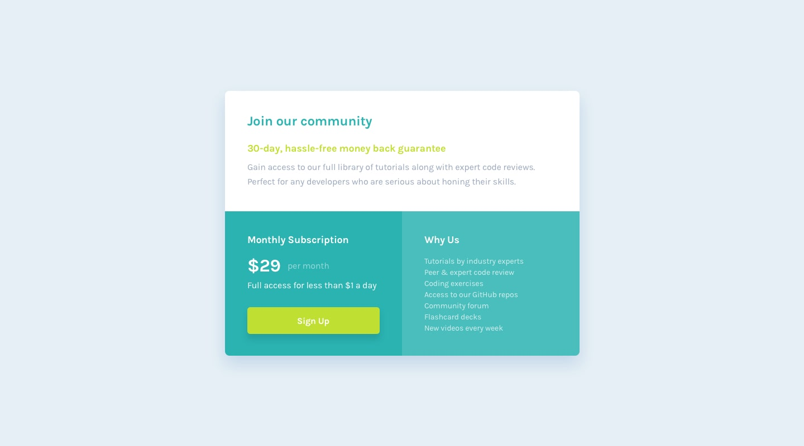
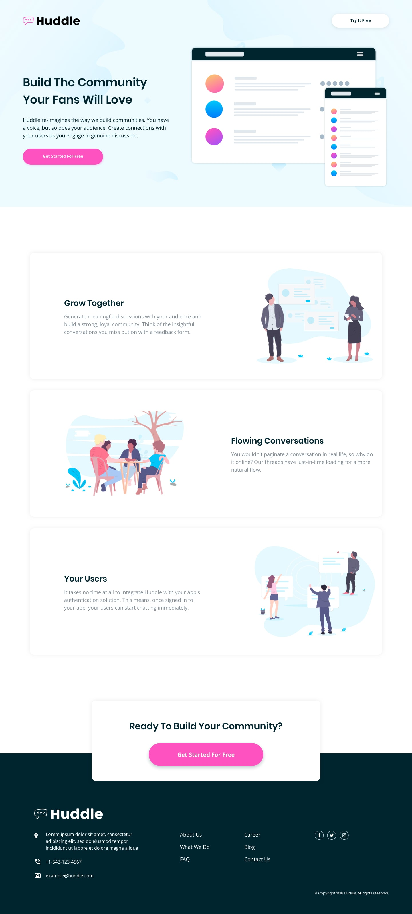
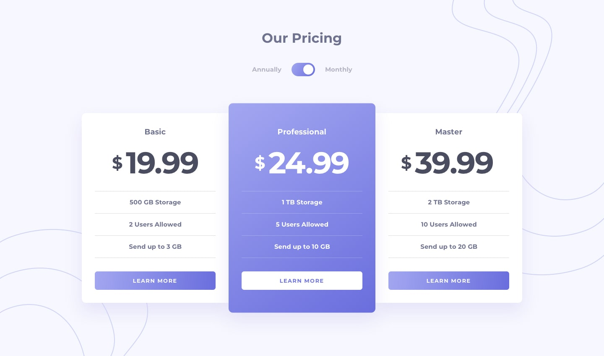

# Frontend Mentor Challenges

My submissions for some of the [frontend mentor challenges](https://www.frontendmentor.io/challenges)

<table>
  <tr>
    <td align="center">
        <a href="./fylo-data-storage-component">
            
             
            
                <b>Fylo Data Storage Component</b>
            
        </a>
    </td>
    <td align="center">
        <a href="./four-card-feature-section">
            
             
            
                <b>Four Card Feature Section</b>
            
        </a>
    </td>
    <td align="center">
        <a href="./coding-bootcamp-testimonials-slider">
            
             
            
                <b>Coding Bootcamp Testimonials Slider</b>
            
        </a>
    </td>
  </tr>
  <tr>
    <td align="center">
      <a href="./base-apparel-coming-soon">
          
           
          
              <b>Base Apparel Coming Soon</b>
          
      </a>
    </td>
    <td align="center">
      <a href="./article-preview-component">
          
           
          
              <b>Article Preview Component</b>
          
      </a>
    </td>
    <td align="center">
      <a href="./intro-component-with-signup-form">
          
           
          
              <b>Article Preview Component</b>
          
      </a>
    </td>
  </tr>
  <tr>
      <td align="center">
        <a href="./single-price-grid-component">
            
             
            
                <b>Single Price Grid Component</b>
            
        </a>
      </td>
      <td align="center">
          <a href="./ping-coming-soon-page">
              
               
              
                  <b>Ping Coming soon Page</b>
              
          </a>
      </td>
    <td align="center">
      <a href="./huddle-landing-page-with-alternating-feature-blocks">
          
           
          
              <b>Huddle Landing Page with alternating Feature Blocks</b>
          
      </a>
    </td>
  </tr>
  <tr>
    <td align="center">
      <a href="./huddle-landing-page-with-single-introductory-section">
          
           
          
              <b>Huddle Landing Page with single introductory section</b>
          
      </a>
    </td>
    <td align="center">
      <a href="./fylo-landing-page-with-two-column-layout">
          
           
          
              <b>Fylo Landing Page with Two Column Layout</b>
          
      </a>
    </td>
    <td align="center">
      <a href="./social-media-dashboard-with-theme-switcher">
          
           
          
              <b>Social Media Dashboard with theme switcher</b>
          
      </a>
    </td>
  </tr>
  <tr>
    <td align="center">
      <a href="./pricing-component-with-toggle">
          
           
          
              <b>Pricing Component With Toggle</b>
          
      </a>
    </td>
  </tr>
</table>

You can see them live [here](https://frontend-mentor.bhanuteja.dev/)
